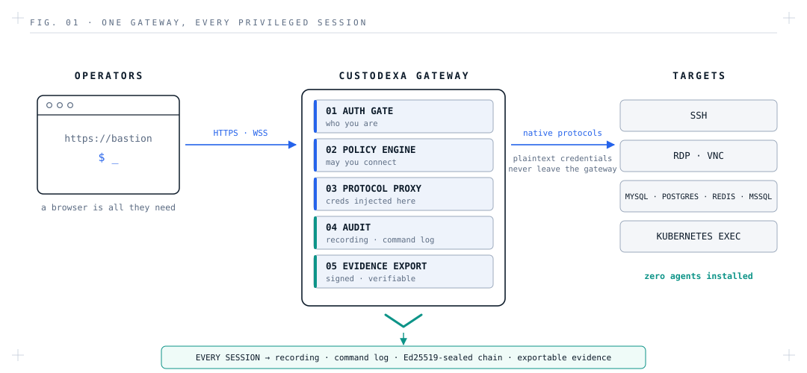

<div align="center">
  
</div>

<p align="center"><b>English</b> | <a href="docs/zh-TW/README.md">繁體中文</a></p>
<p align="center"><a href="https://custodexa.org/en/">Website</a> · <a href="https://custodexa.org/en/docs/quickstart/">Documentation</a></p>

An open-source bastion host: funnel every privileged connection to your servers
and databases through a single gateway — every session recorded, every command logged.

<p align="center">
  <picture>
    <source media="(prefers-color-scheme: dark)" srcset="docs/assets/architecture-dark.svg">
    
  </picture>
</p>

## Why Custodexa

Any team managing a fleet of servers and databases eventually runs into the same
problems:

- **No answers after an incident.** Who connected to which machine, when, and what
  did they do? All you have is shell history and guesswork.
- **Credentials everywhere.** Root passwords and database credentials get passed
  around in note apps and chat windows; one departure forces a company-wide rotation.
- **Auditors want evidence.** "We have controls" doesn't pass an audit. You need
  complete operation logs and session recordings you can actually produce.

## Features

- **Truly open source, single edition.** No enterprise tier, no paywalled features.
  What you see is all there is (AGPL-3.0).
- Eight protocols, one experience: SSH, RDP, VNC, MySQL, PostgreSQL, SQL Server,
  Redis, and Kubernetes exec, each just a browser tab away.
- **Audit first.** Full-session recording with replay (seek, speed control) for every
  protocol. Command-level audit handles full-screen programs like vim correctly;
  clipboard and file-transfer content is captured; dangerous commands can alert or be
  blocked in real time, with webhook notifications.
- Credentials never leave the backend: connections are initiated by the backend
  proxy, with one-time connect tokens, host key verification, and credential rotation
  plans. By default even the platform's own master key lives only in memory, unsealed
  from the browser (switchable to env/KMS modes for unattended operation).
- Fits your environment: LDAP login, MFA (TOTP), and role-based access control down
  to "who may use which account on which machine".
- **Simple to deploy.** One docker compose command, four containers in production,
  no outbound network needed once running.

## Screenshots

| | |
|---|---|
|  |  |
|  |  |

Top-left to bottom-right: dashboard overview, workspace web terminal (with user
watermark), session replay with per-session command log, cross-session command audit.

## Quick Start

```bash
git clone https://github.com/custodexa/custodexa.git
cd custodexa
bash scripts/quickstart.sh --up
```

The script checks `.env` (creating it from the template on first run), generates any
missing secrets with a CSPRNG, starts the stack, waits for the backend to become
healthy, and finishes with the URL and admin login info. Values you have already set
are never touched.

By default the platform's own master key never touches disk. Your first visit opens
the **master-key initialization page**; the key is generated locally in your browser.
Save it — every restart stays sealed until it is entered again. Unattended deployments
can switch to the `env` or KMS key mode in `.env`. Prefer doing it by hand? Copy
`.env.example` to `.env`, follow its inline notes, then `docker compose up -d`.
On Windows, run the script inside WSL.

Then open `http://localhost/` and log in as `admin` with the initial password you set.
The first login walks you through a mandatory password change, after which you can start
adding assets and opening connections.

There are no factory-default passwords; all four secrets must be set by you. This is
deliberate: a bastion host should never go live with default credentials.
Full configuration options, development mode, and troubleshooting are covered in
[docs/QUICKSTART.md](docs/QUICKSTART.md).

**Want to hack on it?** Uncomment `COMPOSE_FILE=docker-compose.dev.yml` in `.env` to
switch to the development stack (hot reload for both frontend and backend, plus test
target machines for every protocol). Start with [CONTRIBUTING.md](CONTRIBUTING.md).

## Architecture

**Backend** Go · Gin · GORM · PostgreSQL 16　**Frontend** Vue 3 · Element Plus · Vite
**Text terminals** xterm.js + native backend proxying　**Graphical protocols**
Apache Guacamole (guacd; RDP/VNC only)

Two decisions that shape the whole system:

- **All protocol handshakes happen in the backend**; the browser is just a display and a
  keyboard. This is what makes "the frontend never sees plaintext credentials" true.
  See `backend/internal/proxy/`.
- **SSH, database CLIs, and Kubernetes exec share a single text-terminal pipeline**:
  recording, command audit, blocking, and live monitoring are implemented once and apply
  uniformly across all eight protocols.

## Documentation

> Full documentation (quick start, operations guides, API reference) is currently written
> in **Traditional Chinese**; the product UI itself supports English. Translation
> contributions are very welcome.

| What you want to do | Read this |
|------|------|
| Deploy and operate | [docs/QUICKSTART.md](docs/QUICKSTART.md) (setup, configuration, troubleshooting); [docs/ops/](docs/ops/) (backup & restore, upgrades, deployment topology, platform credential rotation) |
| Contribute | [CONTRIBUTING.md](CONTRIBUTING.md) (DCO, workflow); [docs/dev/](docs/dev/) (architecture and testing discipline); [openspec/specs/](openspec/specs/) (behavioral specs, the source of truth for details) |
| Look up the API or schema | [docs/API_SPEC.md](docs/API_SPEC.md), [docs/DB_SCHEMA.md](docs/DB_SCHEMA.md) |
| Report a security issue | [SECURITY.md](SECURITY.md) (private reporting channel and handling policy) |

## Design boundaries

Worth knowing before you deploy:

- **It governs the connections that pass through it.** Traffic that connects directly to
  a target host is outside its view. Use your network layer (firewalls / security
  groups) to close off direct access and make the bastion the only entrance.
- **Text-based command audit has inherent limits** (edge behaviors of some full-screen
  programs, input without echo). When in doubt, the **session recording replay** is the
  source of truth: it captures the actual screen, with no reconstruction or inference.
- **A failed audit write never kills your connection**, but the UI clearly signals the
  degraded state instead of pretending everything is fine.

## Related Projects

- [Apache Guacamole](https://guacamole.apache.org/) - clientless remote desktop gateway

## License

This project is released under the **GNU Affero General Public License v3.0
(AGPL-3.0)**; see [LICENSE](LICENSE) for the full text.

The network clause of AGPL-3.0 (Section 13) requires that if you modify this software
and offer it as a network service, you must also offer the complete corresponding source
of your modified version to the users of that service.

**Single edition, no tiers.** There is no enterprise version, no paid feature unlocks,
and no separately licensed modules. Contributions are
accepted under the DCO rather than a CLA (see [CONTRIBUTING.md](CONTRIBUTING.md));
the project does not ask for, and does not hold, the right to re-license external
contributions under a closed-source license.

### Third-Party Components

The distribution also contains 218 third-party components, each retaining its original
license; see [THIRD-PARTY-LICENSES.md](THIRD-PARTY-LICENSES.md) for the inventory,
[NOTICE](NOTICE) for Apache License 2.0 attribution notices, and [`licenses/`](licenses/)
for copies of the license texts.

Container images are based on Alpine Linux and contain GPL/LGPL components running as
separate processes. The version table and how to obtain their corresponding source are in Section 3 of
[THIRD-PARTY-LICENSES.md](THIRD-PARTY-LICENSES.md); open a repository issue if a
source cannot be reached.

