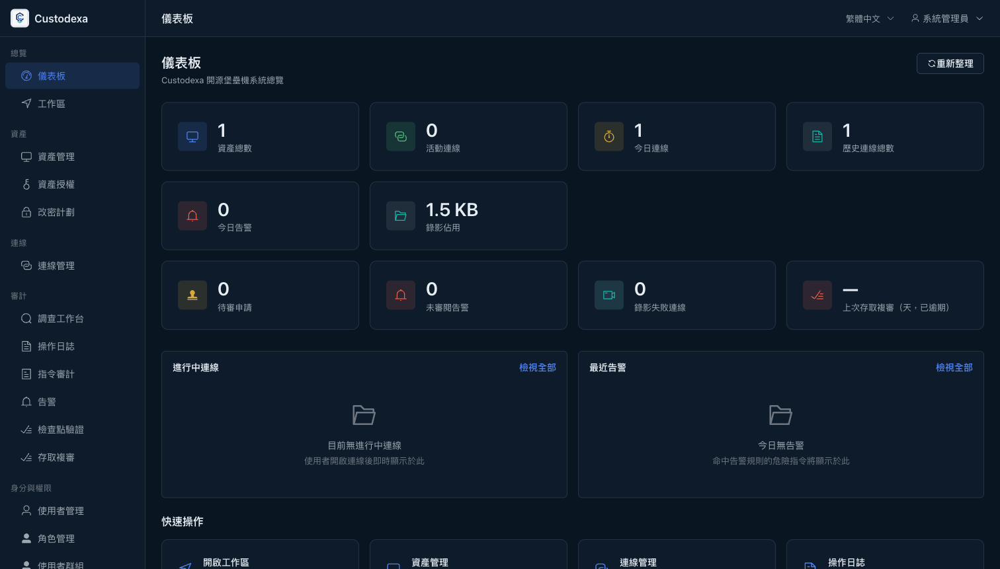
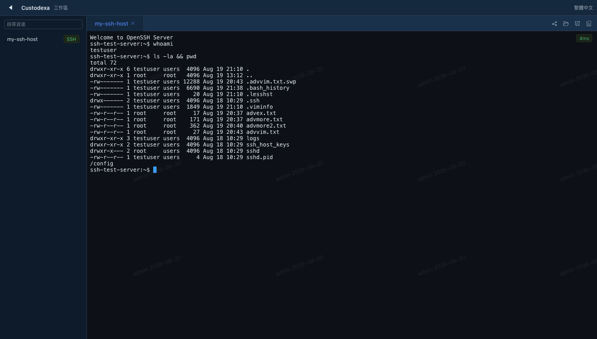
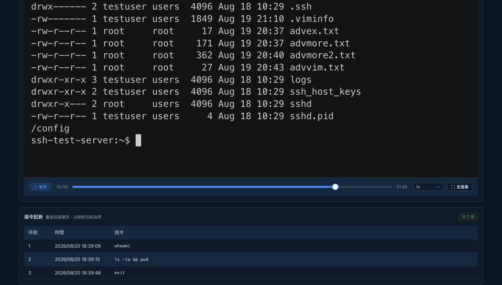
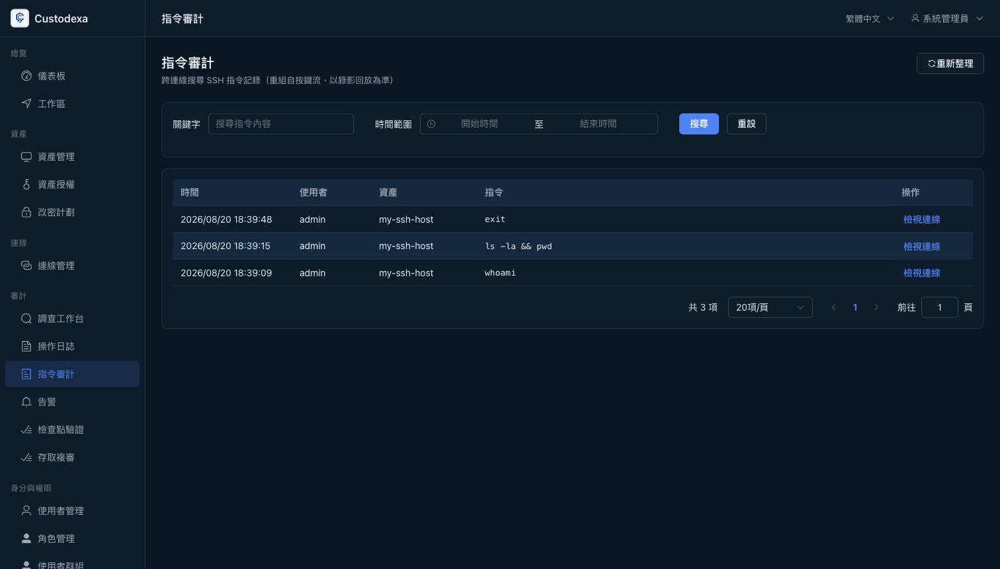

<div align="center">
  
</div>

<p align="center"><a href="../../README.md">English</a> | <b>繁體中文</b></p>
<p align="center"><a href="https://custodexa.org/">官方網站</a> · <a href="https://custodexa.org/docs/quickstart/">線上文件</a></p>

開源堡壘機（Bastion Host）：把進入伺服器與資料庫的特權連線收攏到同一個入口，
每一次連線都有錄影，每一條指令都有紀錄。

## 為什麼需要它

管理一群伺服器與資料庫的團隊，遲早會撞上同一批問題：

- **出事之後查不到。** 誰在什麼時候連過哪台機器、做了什麼？只剩 shell history 和猜測。
- **憑證滿天飛。** root 密碼與資料庫帳密在筆記軟體和聊天視窗裡傳來傳去，離職一個人就要全面換密。
- **稽核要證據。** 口頭說「我們有管控」過不了關，要拿得出完整的操作紀錄與錄影。

Custodexa 的做法：使用者透過瀏覽器連上目標主機，明文憑證只存在後端、
前端與使用者永遠接觸不到；全程錄影可回放，指令級審計可搜尋、可告警、可即時阻斷。
目標主機**不需要安裝任何 agent**。

## 特點

- **真正開源，單一版本。** 沒有企業版、沒有付費解鎖的功能，你看到的就是全部（AGPL-3.0）。
- 八種協議同一種體驗：SSH、RDP、VNC、MySQL、PostgreSQL、SQL Server、Redis、K8s exec，
  都在瀏覽器裡開一個分頁就能連。
- **審計優先。** 全協議錄影回放（可快轉、拖進度條）；指令級審計經虛擬螢幕重組，
  能正確處理 vim 這類全螢幕程式；剪貼簿與檔案傳輸內容留痕，危險指令可告警、可即時阻斷，
  外加 webhook 通知。
- 憑證不落地：連線由後端代理發起，一次性 connect token、host key 驗證、資產改密計劃。
  出貨預設連平台自身的根金鑰都只存在記憶體、由瀏覽器解封（可切換 env／KMS 模式支援無人值守）。
- 接得上你的環境：LDAP 登入、MFA（TOTP）、角色權限控到「誰能用哪個帳號連哪台機器」。
- **部署簡單。** docker compose 一條指令，正式版就四個容器，啟動後不需要對外網路。

## 畫面

| | |
|---|---|
|  |  |
|  |  |

左上起：儀表板總覽、工作區網頁終端（含使用者浮水印）、會話錄影回放與指令記錄、指令審計搜尋。

## 快速開始

```bash
git clone https://github.com/custodexa/custodexa.git
cd custodexa
bash scripts/quickstart.sh --up
```

腳本會檢查 `.env`（沒有就從範本建立）、用 CSPRNG 生成缺少的機密、啟動服務並等待
後端健康，最後輸出連線網址與 admin 登入資訊；你已經填好的值一律不動。

出貨預設下，平台自身的根金鑰**永不落地**。首次造訪會先進入**主金鑰初始化頁**，
金鑰在你的瀏覽器本地生成。務必保存好：之後每次重啟都停在封印狀態，要再輸入才解封。
接著才是登入與強制改密。無人值守的部署可在 `.env` 改用 env 或 KMS 金鑰模式。想手動設定？照
`.env.example` 內的逐項說明複製編輯後 `docker compose up -d` 即可。
Windows 請在 WSL 內執行腳本。

啟動後開 `http://localhost/`，以 `admin` 加上你設定的初始密碼登入，
首次登入會先引導你改密，之後就能開始加資產、發起連線。

沒有出廠預設密碼。四項機密都要你自己設，這是刻意的：堡壘機不該帶著預設憑證上線。
完整設定選項、開發模式與故障排除見 [docs/QUICKSTART.md](../QUICKSTART.md)。

**想參與開發？** 在 `.env` 取消 `COMPOSE_FILE=docker-compose.dev.yml` 的註解即切到開發版
（前後端熱重載，並附各協議的測試靶機），入口見 [CONTRIBUTING.md](../../CONTRIBUTING.md)。

## 路線圖

這些是已在計畫中的方向，是意向不是時程承諾，歡迎開 issue 討論：

- 離線安裝包：面向 air-gap 環境的映像打包交付。
- 指令審計的輸入方向紀錄，補上「指令送出後連線立即中斷」這類目前補不到的審計形態。
- 高可用部署：多實例與金鑰服務的 HA。
- CI 公開化與更多協議支援。
- 英文文檔：README 已雙語，完整文檔的英文化歡迎協作。

## 技術架構

**後端** Go · Gin · GORM · PostgreSQL 16　**前端** Vue 3 · Element Plus · Vite
**文字終端** xterm.js ＋ 後端原生代理　**圖形協議** Apache Guacamole（guacd，僅 RDP/VNC）

兩個貫穿全系統的架構決策：

- **握手全部在後端完成**，瀏覽器只是顯示器與鍵盤。這就是「前端拿不到明文憑證」的由來。
  實作見 `backend/internal/proxy/`。
- **SSH、資料庫 CLI、K8s exec 共用同一條文字終端鏈路**，錄影、指令審計、阻斷、監看
  四件事只實作一次，八種協議一致生效。

## 文檔地圖

| 你想做什麼 | 讀這些 |
|------|------|
| 部署與日常維運 | [docs/QUICKSTART.md](../QUICKSTART.md)（啟動、設定、故障排除）；[docs/ops/](../ops/)（備份還原、升級、部署形態、平台憑證輪替） |
| 參與開發 | [CONTRIBUTING.md](../../CONTRIBUTING.md)（DCO、工作流程）；[docs/dev/](../dev/)（架構與測試紀律）；[openspec/specs/](../../openspec/specs/)（行為規格，細節以此為準） |
| 查 API 與資料庫 | [docs/API_SPEC.md](../API_SPEC.md)、[docs/DB_SCHEMA.md](../DB_SCHEMA.md) |
| 回報安全問題 | [SECURITY.md](SECURITY.md)（私密回報管道與處置方式；英文版在[repo 根目錄](../../SECURITY.md)） |

## 設計邊界

部署前值得知道的界線：

- **它管的是「經過它的連線」**。若目標主機仍開放直連，那些流量不在它的視野內。
  請用網路層（防火牆／安全群組）把直連封掉，讓堡壘機成為唯一入口。
- **文字指令審計有先天極限**（例如某些全螢幕程式的邊角行為、無回顯輸入）。
  有爭議時，以**連線錄影回放**為事實來源，錄影記的是實際畫面，不經任何重組推斷。
- **審計寫入失敗不會中斷你的連線**，但介面會明確提示降級狀態，不會假裝一切正常。

## 參考專案

- [Apache Guacamole](https://guacamole.apache.org/) - 無客戶端遠端桌面閘道

## 授權

本專案以 **GNU Affero General Public License v3.0（AGPL-3.0）** 授權發佈，全文見 [LICENSE](../../LICENSE)。

AGPL-3.0 的網路服務條款（第 13 條）要求：若你修改本軟體並透過網路提供服務給使用者，
須同時向這些使用者提供修改後的完整原始碼。

**單一版本，不分級。** 沒有企業版、沒有付費解鎖的功能、也沒有另行授權的模組。
貢獻採 DCO 而非 CLA（見 [CONTRIBUTING.md](../../CONTRIBUTING.md)），
專案不要求、也不持有把外部貢獻改以閉源授權散布的權利。

### 第三方元件

散布物另含 218 個第三方元件，各自保留其原授權，清單見
[THIRD-PARTY-LICENSES.md](../../THIRD-PARTY-LICENSES.md)；
Apache License 2.0 元件的歸屬聲明見 [NOTICE](../../NOTICE)；授權正文副本在 [`licenses/`](../../licenses/)。

容器映像以 Alpine Linux 為基礎系統，內含以獨立行程執行的 GPL／LGPL 元件。
其版本表與對應源碼的取得方式（依 GPL-3.0 §6(d)／GPL-2.0 §3 末段，以指向公開源碼庫的方式提供，
取不到時可開 issue 由我們協助取得），見
[THIRD-PARTY-LICENSES.md](../../THIRD-PARTY-LICENSES.md) 第 3 節。

